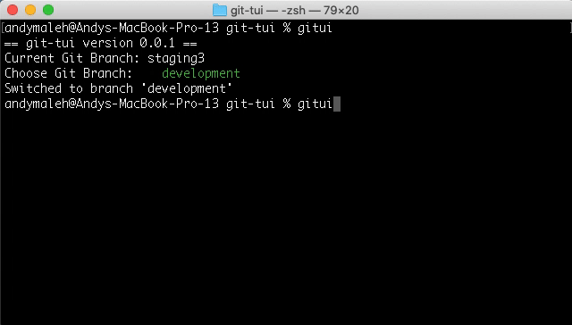

# Git-TUI (Git Text-based User Interface)
[](https://badge.fury.io/rb/git-tui)



Other TUI gems you may be interested in:
- [rake-tui](https://github.com/AndyObtiva/rake-tui)
- [rvm-tui](https://github.com/AndyObtiva/rvm-tui)

## Pre-requisites

- [Git](https://git-scm.com/downloads)
- [MRI Ruby](https://www.ruby-lang.org/en/) installed via [RVM](https://rvm.io)
- [Bash](https://www.gnu.org/software/bash/) or [Zsh](http://zsh.sourceforge.net/) (Z Shell) (including Sed)

## Setup Instructions

The gem can be installed unto any [Ruby](https://rvm.io/rubies/installing)/[Gemset](https://rvm.io/gemsets/basics) in [RVM](https://rvm.io) and it will be used from there everywhere.

Since it is independent of any particular [Ruby](https://www.ruby-lang.org/en/) project, it is recommended you install unto the default [gemset](https://rvm.io/gemsets/basics) (or optionally into its own gemset if you prefer). Global gemset wouldn't be enough to share it since it does not cross Rubies yet is limited to a specific Ruby version.

Afterwards, run the `git-tui-setup` command from the same [Ruby](https://rvm.io/rubies/installing)/[Gemset](https://rvm.io/gemsets/basics) you installed the gem at to setup the `git-tui` function source in `~/.bash_profile` or `~/.bashrc` (whichever is available)

These are the commands you need to run in order to select a Ruby and gemset, install gem, and finally setup gem commands globablly in the shell environment:

```
rvm use @default # or a different ruby version/gemset like `rvm use ruby-3.1.0@git-tui --create`
gem install git-tui
git-tui-setup
```

## Usage

Currently, only git branch checkout is supported.

Simply run this command:

```
gitui
```

Or one of the aliases:

```
git-ui
git-tui
```

## Contributing

-   Make sure you have [RVM](https://rvm.io) installed
-   Check out the latest master to make sure the feature hasn't been
    implemented or the bug hasn't been fixed yet.
-   Check out the issue tracker to make sure someone already hasn't
    requested it and/or contributed it.
-   Fork the project.
-   Start a feature/bugfix branch.
-   `bundle`
-   Commit and push until you are happy with your contribution.
-   `rake install` to test (or `rake build`, `rvm use @default`, and then `gem install pkg/git-tui-{version}.gem`)
-   Please try not to mess with the Rakefile, version, or change log. If
    you want to have your own version, or is otherwise necessary, that
    is fine, but please isolate to its own commit so I can cherry-pick
    around it.

## TODO

[TODO.md](TODO.md)

## Change Log

[CHANGELOG.md](CHANGELOG.md)

## License

[MIT](LICENSE.txt)

Copyright (c) 2022 Andy Maleh
